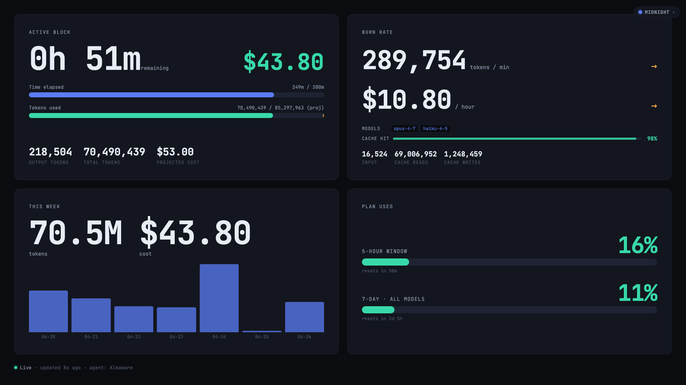
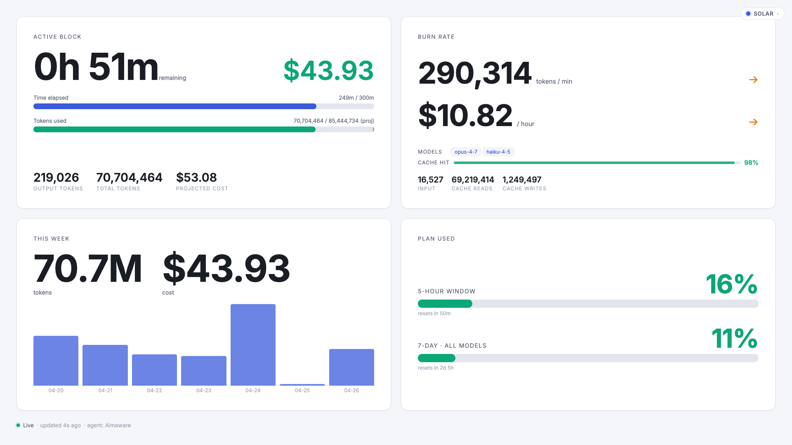
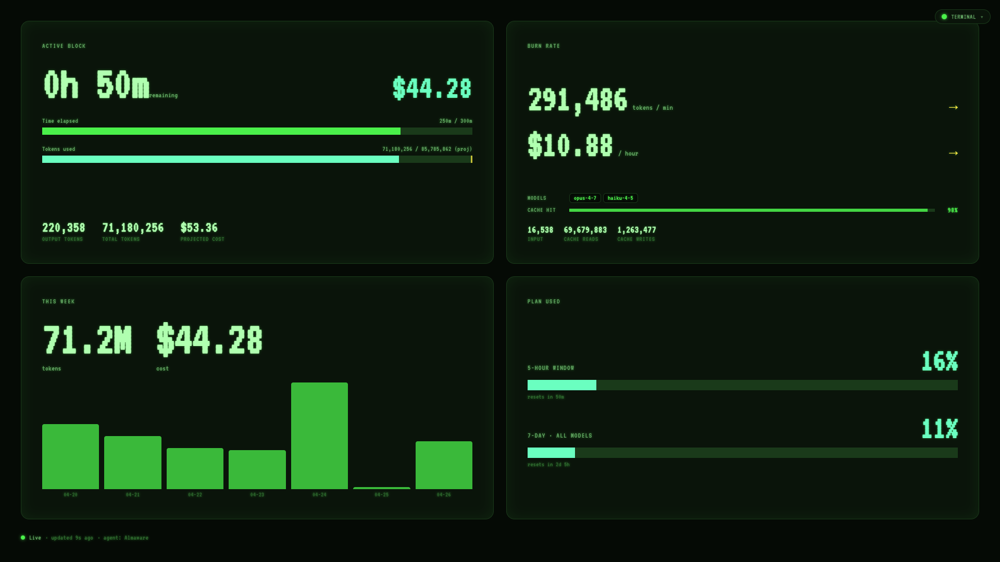
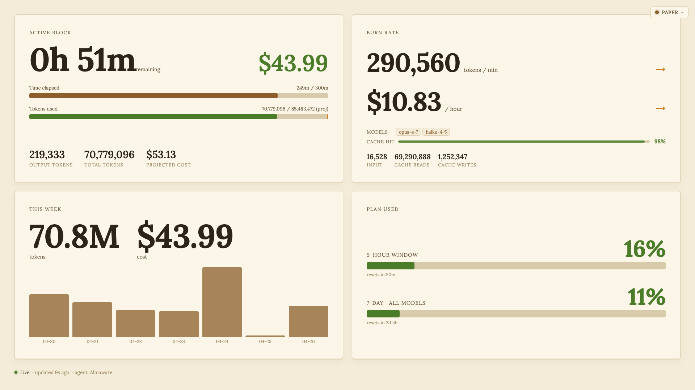
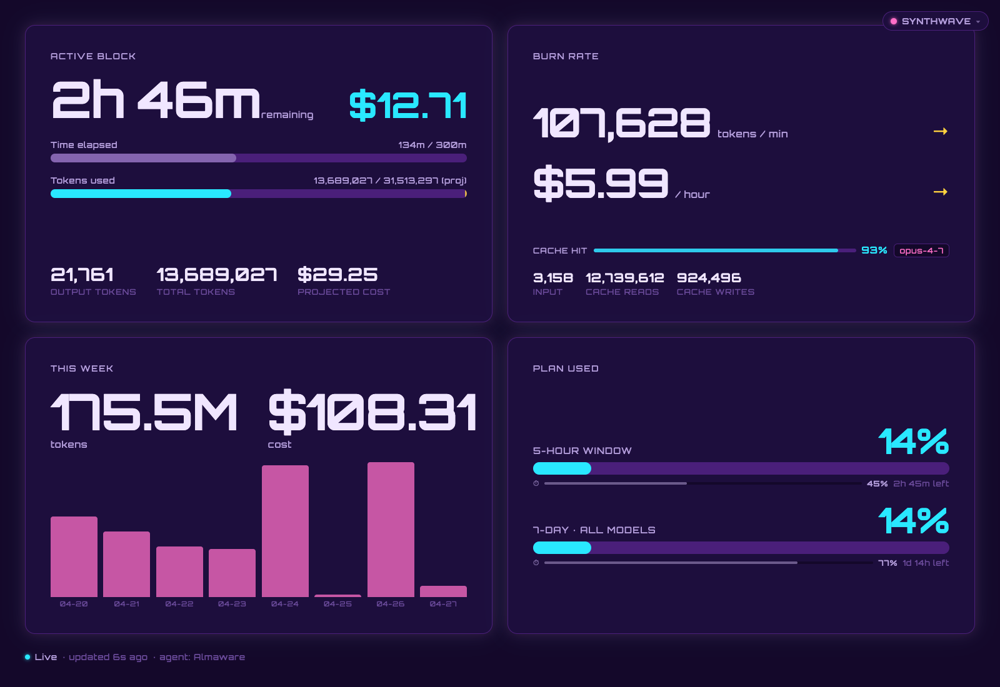

# Claude Code Plan Usage — TV Dashboard

Full-screen dashboard that shows your Claude Code Pro/Max subscription usage in real time on a TV browser.



```
Local machine (Claude Code installed)        Remote server              TV browser
┌────────────────────────────────┐          ┌────────────┐          ┌──────────┐
│  agent — polls ccusage every   │─POST/10s→│  server    │─WebSocket│  web     │
│  10s, pushes to server         │          │  (relay)   │────────▶ │  dashboard│
└────────────────────────────────┘          └────────────┘          └──────────┘
```

## Packages

| Package | Purpose |
|---------|---------|
| `shared/` | Shared TypeScript types (`UsageSnapshot`) |
| `agent/` | Runs on the Claude Code machine — polls `ccusage`, pushes to server |
| `server/` | Remote-deployable Node HTTP + WebSocket server |
| `web/` | Vite + React TV dashboard |

## Quick start (local dev)

```bash
cp .env.example .env
# Edit .env — set AGENT_TOKEN to any random secret

pnpm install
pnpm dev
```

Opens:
- Server: `http://localhost:8787`
- Web dev server: `http://localhost:5173`

## Production deployment

### 1. Build

```bash
pnpm build
```

### 2. Deploy the server

Copy `server/dist/` and `server/node_modules/` to the remote host. Set env vars:

```bash
PORT=8787
AGENT_TOKEN=<same-secret-as-agent>
```

Run: `node server/dist/index.js`

### 3. Run the agent (on your Claude Code machine)

Copy `agent/dist/` and `agent/node_modules/` to the machine where Claude Code is installed. Set env vars:

```bash
SERVER_URL=https://your-server.com
AGENT_TOKEN=<same-secret-as-server>
POLL_MS=10000           # optional, default 10s
AGENT_HOST_LABEL=       # optional, defaults to hostname
```

Run: `node agent/dist/index.js`

To run as a background service on macOS, create a `launchd` plist in `~/Library/LaunchAgents/`.

### 4. Open on TV

Navigate to `https://your-server.com` in a fullscreen/kiosk browser.

## Environment variables

| Var | Default | Where |
|-----|---------|-------|
| `AGENT_TOKEN` | required | both agent & server |
| `PORT` | `8787` | server |
| `STALE_MS` | `60000` | server — ms before snapshot is flagged stale |
| `STALE_CHECK_MS` | `15000` | server — interval to broadcast stale status |
| `SERVER_URL` | `http://localhost:8787` | agent |
| `POLL_MS` | `10000` | agent |
| `AGENT_HOST_LABEL` | `hostname()` | agent |

## Themes

The dashboard ships with **5 themes**, selectable from the menu in the upper right corner.
Layout, card positions and data are identical across themes — only colors, typography
and accents change. Your choice persists in `localStorage` (`cc-usage-theme`).

| Theme | Mode | Style | Font |
|-------|------|-------|------|
| **Midnight** | Dark | Default — calm navy with blue/teal accents | JetBrains Mono |
| **Solar** | Light | Clean modern UI, indigo accents, soft shadows | Inter |
| **Terminal** | Dark | CRT phosphor green, square corners, glow text | VT323 |
| **Paper** | Light | Warm cream background, brown/olive serif | Lora |
| **Synthwave** | Dark | Retro neon — deep purple with pink/cyan glow | Orbitron |

### Midnight (default)


### Solar


### Terminal


### Paper


### Synthwave


## Burn-in protection (OLED / LED TVs)

Because the dashboard is designed to be left on a TV for hours or days,
it ships with a built-in screen-saver layer that mitigates **OLED burn-in**
and LED image retention. It runs unconditionally — no toggle, no JS,
pure CSS — and it disables itself automatically when the user has set
`prefers-reduced-motion: reduce`.

Two complementary techniques are combined:

1. **Pixel orbiter** — the entire dashboard is translated by **1 px** on a
   4-direction cycle (top-left → top-right → bottom-right → bottom-left),
   one step per **60 s**, full cycle every **4 minutes**. This is the
   exact same principle TV manufacturers ship under the names *Pixel
   Shift* (Samsung / Sony) and *Screen Shift* (LG): static labels and
   numbers never sit on the same physical sub-pixel for long, so wear
   is spread out.
2. **Brief brightness pulse** — once per minute the canvas dips to
   `filter: brightness(0.85)` for ≈80 ms (≈5 frames at 60 Hz). Below
   the threshold of conscious perception but enough to force every LED
   off its steady-state drive level, breaking the always-on luminance
   pattern that drives burn-in.

The shift amount is small enough that nothing visibly moves and the
1 px translation never exposes an edge (the page background fills
behind the dashboard). Together the two techniques cover both the
**spatial** (pixel position) and **temporal** (luminance) sources of
burn-in described in OLED manufacturer documentation.

If you'd rather opt out (e.g. on a non-OLED display), set
`prefers-reduced-motion: reduce` in your OS or browser settings.

## Requirements

- Node ≥ 20 on both agent machine and server
- `npx` available on the agent machine (used to run `ccusage@latest`)
- Claude Code installed on the agent machine (`~/.claude/projects/` must exist)
- pnpm ≥ 10 for development
